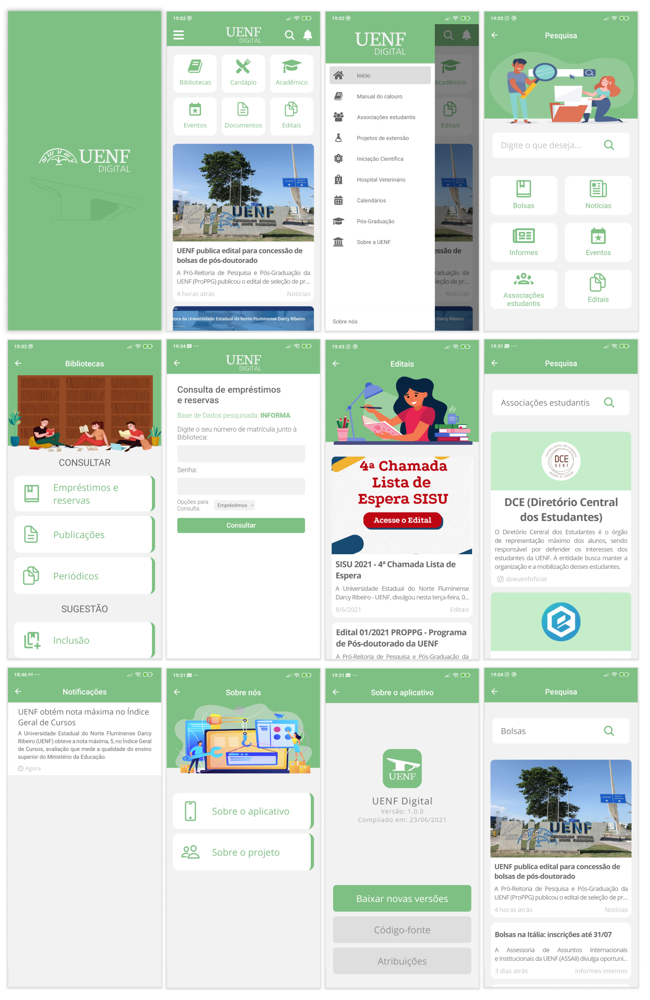

# UENF Digital APP

  

UENF Digital APP se trata de um aplicativo produzido no projeto de extensão UENF DIGITAL: UM NOVO OLHAR, na Universidade Estadual do Norte Fluminense Darcy Ribeiro (UENF), baseado na plataforma UENF Digital. O aplicativo tem como objetivo facilitar para os estudantes e a comunidade externa o acesso às informações da universidade.

## Funcionalidades 

- **Todas as postagens do site principal da UENF e da Plataforma UENF Digital**
- **Pesquisa de postagens**
- **Notificações**
    - Postagens recentes de forma automática
    - Personalizadas
- **Bibliotecas**
    - Consultas
        - Empréstimos
		- Reservas
		- Publicações
		- Periódicos
    - **Sugestão de inclusão**
- **Cardápio do Restaurante Universitário**

## Instalação do aplicativo
Em breve 🚧 